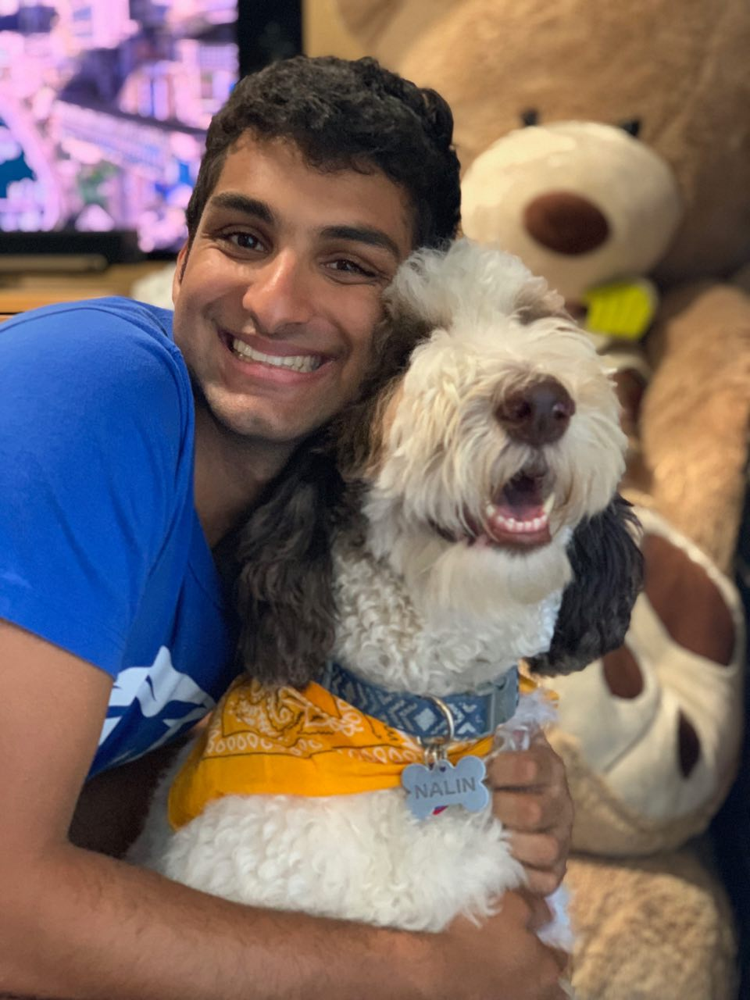

# hw01

## About me
**Hi --- I'm Neeraj!** I just finished my first year at UChicago, and am an Economics and Political Science double major. I honestly haven't done much work in my majors thus far, and have instead opted to do mostly core throughout my first year. I'm enrolled in the summer quarter as part of the Institute in the Social Research Methods. If I had to guess, that's why most of the undergraduates are also enrolled in this course. After the Summer quarter classes end, I'll be RAing for Professor Mark Bradley, Professor in the History Department. I'm going to be applying the computational social science skills I gain in this class to identify meaningful relationships between the policy actions and rhetoric surrounding the ideas surrounding the 'Third World' and 'Global South.'

Outside of class, I'm a rower on the UChicago crew team. I'm currently in my 5th year of crew, having previously rowed for four years in high school. Fun fact: my high school team was the team that one of the USC admits said they rowed for when cheating their way into college. Apparently, reporters showed up to our practices for a few weeks after the college admission scandel broke. You can read a little about it [here](https://www.nydailynews.com/news/national/ny-redwood-scullers-college-bribery-scandal-20190324-k3zrvb55grhwzcr6r2djmjfgmy-story.html).

Additionally, I'm a barista for the Harper Café right outside the reading room in the Harper Memorial Library. This is an awesome job: I get free coffee. Enough said. I also get paid to watch TV most of the time, which is basically everyone's dream job. I love work, and I love my coworkers. It's a really fun time. 

### My Family
I'm from the SF Bay Area (Menlo Park; it's right next to Stanford) and have a decent amount of family nearby. I live with my Mom, Dad, younger brother, and my maternal grandparents. My maternal uncle and his family just relocated from New Jersey to  15 minutes away from us, so we frequently get together for dinners, and other family events. Despite having so much family nearby, it's easy for me to choose a favorite family member: my dog. 

{width=250px}

## How I made this readme file

The part I struggled most with was figuring out how to sizedown the photo of me and my dog. I was struggling to find a way to scale down using standard RMarkdown syntax; many online forms/guides recommended embedding R code in the document, but I personally wanted to stay away from that. [This](https://stackoverflow.com/questions/15625990/how-to-set-size-for-local-image-using-knitr-for-markdown) stackoverflow question helped me out. The third most recommended answer contains the RMarkdown syntax for sizing images, and is the solution I implimented in my code. 

I pushed my code to github twice through this process. I pushed it once when I was roughly 10% finished with the About me section, just to make sure I had the right idea about how to use git and would be able to properly submit my project when it came time to do so. Secondly, I pushed my project after I finished it. This is the version you're looking at now! I'm not sure if I have the terminology completely down yet, but I think I'm approximately correct. 